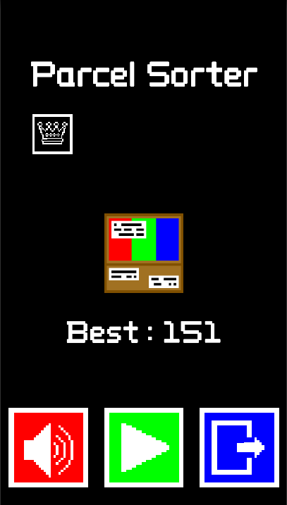

# ParcelSorter
- 개요 : 계속 내려오는 세 종류의 택배들을 알맞은 방향으로 가도록 분류해야한다.
- 장르 : 아케이드
- 개발 인원 : 1명
- 개발 도구 : C#, Unity, VSCode, Piskel
- 개발 기간 : 10월 1일 ~ 10월 20일
---
## 스크린샷
- 메인 화면 / 게임 화면 / 일시정지 화면 / 게임오버 화면

   
## 게임 설명
### 메인 화면
- 음소거 버튼을 이용해서 게임 내의 소리를 키고 끌 수 있다.
- 플레이 버튼을 이용해서 게임을 시작할 수 있다.
- 나가기 버튼을 이용해서 게임을 나갈 수 있다.
- 최고점수판을 통해서 자신의 최고점수를 확인할 수 있다.
### 게임 화면
- 상자 색깔과 같은 버튼을 눌러서 택배를 분류한다.
- 택배 분류에 성공할 때마다 점수가 1씩 오른다.
- 점수판을 통해서 현재 자신의 점수를 확인할 수 있다.
- 실패하게 되면 게임오버 화면이 나타난다.
- 일시정지 버튼을 이용해서 게임을 일시정지하고 일시정지 화면이 나타난다.
### 일시정지
- 이어하기 버튼을 이용해서 게임을 이어서 할 수 있다.
- 다시하기 버튼을 이용해서 게임을 다시 시작할 수 있다.
- 메인화면 버튼을 이용해서 메인화면으로 이동할 수 있다.
### 게임 오버
- 최고점수판을 통해서 자신의 최고점수를 확인할 수 있다.
- 점수판을 통해서 이번 게임에서 자신의 점수를 확인할 수 있다.
- 다시하기 버튼을 이용해서 게임을 다시 시작할 수 있다.
- 메인화면 버튼을 이용해서 메인화면으로 이동할 수 있다.